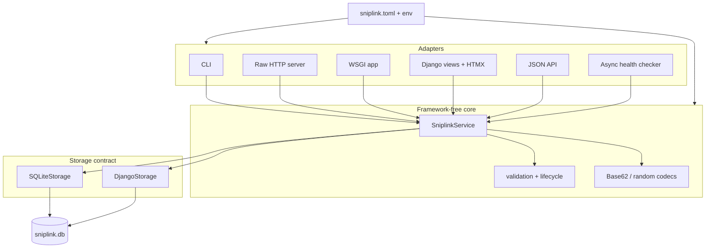
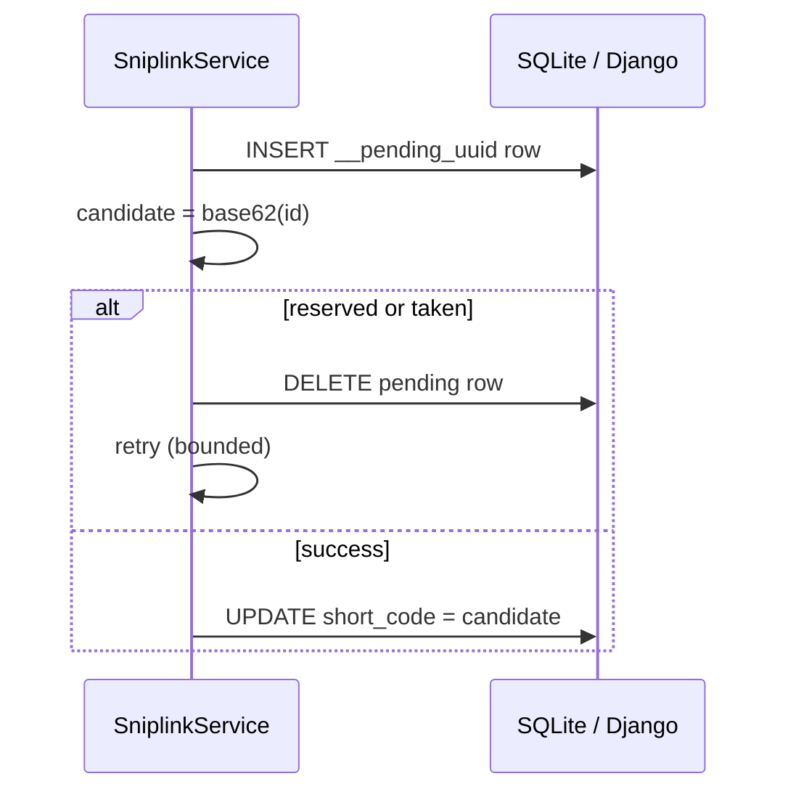

# Architecture

## Elevator pitch (30 seconds)

**sniplink** is one framework-free URL-shortening engine with five adapters — CLI,
raw TCP HTTP, hand-written WSGI, Django + HTMX, and a JSON API — all reading
and writing the same SQLite file through a shared storage contract.

## Layered design

## Base62 collision flow

The database ``UNIQUE(short_code)`` constraint is the authority — not a
pre-insert SELECT. See ADR 0004.

## Shared database bootstrap

| Order | Command |
| ----- | ------- |
| Django-first | `python web/manage.py migrate` |
| CLI-first | `sniplink init-db` then `python web/manage.py migrate --fake-initial` |

Migrations `0002`–`0005` reconcile legacy table names, indexes, and metadata.

## Intentionally out of scope

These are documented stretch goals (see `docs/planning/timeline.md`), not bugs:

- Redis / application cache (ADR 0007)
- Token-bucket rate limiting
- Full API-key rotation and scopes
- Multi-worker production deployment
- Geo / UA-family analytics

## API lifecycle semantics

| Operation | Repeat call on gone link |
| --------- | ---------------------- |
| `POST …/disable` | `410 Gone` (strict) |
| `DELETE …/links/{code}` | `204 No Content` (idempotent) |

## Async health checker

Concurrent HEAD probes use a semaphore (`concurrency`) and per-link
``asyncio.wait_for`` timeouts. Timing scope, private-host safety, and
**cancellation** semantics are documented in
``src/sniplink/async_tools/health_checker.py``: caller cancellation
propagates (it is not turned into a health-check row); per-link timeouts
become error results; socket writers are closed in ``finally`` blocks.

## Further reading

- [Defense FAQ](defense-faq.md)
- [Security & privacy](security.md)
- [Submission checklist](submission-checklist.md)
- ADRs in [docs/adr](adr/)
